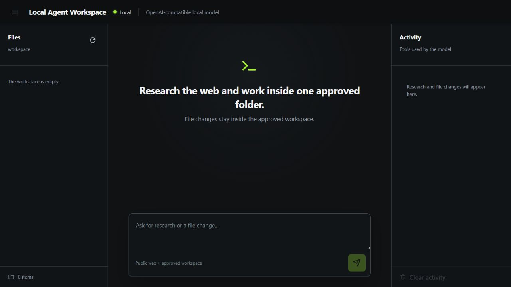
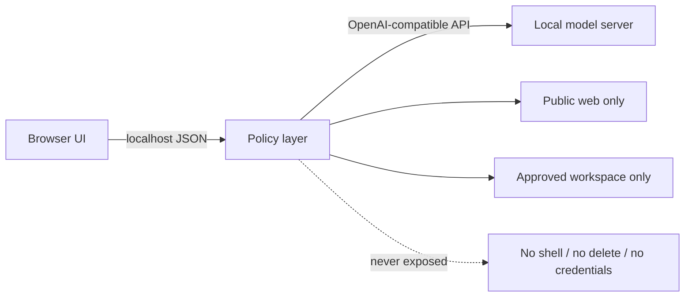

# Local Agent Workspace

A Windows-first, least-privilege tool layer and web UI for local models that expose an OpenAI-compatible chat completions endpoint.

Local Agent Workspace lets a model search the public web and work with text files without giving it a shell, deletion capability, credential access, or unrestricted filesystem access.



> Early release: `v0.3.0`. Review the [security model](SECURITY.md) before using it with important files.

## What it provides

- Native OpenAI-style function calling loop.
- Public web search and page fetching.
- DNS-pinned HTTP connections, redirect validation, private-address blocking, and a web-port allowlist.
- Read, create, and exact-replacement edit tools restricted to one configured workspace.
- No shell tool and no file deletion tool.
- Path traversal and Windows reparse-point protection.
- Loopback-only server by default, JSON-only writes, origin checks, and a restrictive content security policy.
- Responsive React UI with a file tree, read-only preview, and visible tool activity.
- One-click **New chat** reset that clears client-side context without unloading the model.
- Context budgeting that counts llama.cpp prompt tokens, bounds tool output, drops stale chat history, and reserves room for the final answer.
- Safe final-answer fallback when a tool-heavy turn reaches its context or tool-round budget.
- Double-click Windows launchers after a local model server is available.
- Python standard-library backend with no runtime package installation.

## Architecture



The model can only request the functions declared by the policy layer. Every file path and web destination is validated again when the function executes.

## Requirements

- Windows 10 or 11 for the included double-click launchers.
- Python 3.10 or newer.
- Node.js 20.19 or newer when running from a source checkout. Node is only used to build the UI.
- A local model server with an OpenAI-compatible `/v1/chat/completions` endpoint and tool-calling support.
- A model-server context of at least **8192 tokens** is recommended; **16384** is a better starting point for multi-page research. Tool schemas consume context before the user's message is added.

The backend itself is cross-platform, but the convenience launchers are currently PowerShell-based.

## Quick start with llama.cpp

Start a tool-capable model with a context large enough for the tool definitions. A single-user server can avoid unnecessary parallel slots:

```powershell
llama-server.exe `
  --model C:\Models\your-model.gguf `
  --alias local-model `
  --host 127.0.0.1 `
  --port 8080 `
  --ctx-size 16384 `
  --parallel 1 `
  --gpu-layers auto `
  --fit on `
  --flash-attn on `
  --jinja
```

Then:

1. Clone or download this repository.
2. Double-click `Start Local Agent.cmd`.
3. The first run creates `config.json`, installs the pinned frontend dependencies, builds the UI, and opens `http://127.0.0.1:8090`.
4. Put files the agent may access in the configured `workspace` directory.

Double-click `Stop Local Agent.cmd` to stop the policy layer. Your model server remains under your control.

## Configuration

The first launch copies [`config.example.json`](config.example.json) to the ignored local file `config.json`.

Important fields:

| Field | Default | Purpose |
| --- | --- | --- |
| `server.host` | `127.0.0.1` | Interface bind address. Non-loopback binding is refused unless explicitly enabled. |
| `server.port` | `8090` | UI and policy-layer port. |
| `model.api_url` | `http://127.0.0.1:8080/v1/chat/completions` | OpenAI-compatible endpoint. |
| `model.name` | `local-model` | Model name or alias sent to the endpoint. |
| `model.disable_thinking` | `false` | Sends the llama.cpp-compatible `enable_thinking: false` template option when enabled. |
| `model.request_timeout_seconds` | `900` | Per-model-step timeout; large local prompts can take several minutes. |
| `model.context_window` | `8192` | Must match the context configured in the model server. |
| `model.context_reserve_tokens` | `2048` | Space kept free for the final answer. Must be at least `model.max_tokens`. |
| `model.token_counting` | `estimate` | Use `llama_cpp` for exact local `/apply-template` and `/tokenize` counting, with automatic estimation fallback. |
| `files.workspace` | `./workspace` | The only directory exposed to file tools. |
| `web.allowed_ports` | `80`, `443` | Destination ports allowed for public web fetching. |
| `limits.max_tool_result_chars` | `8000` | Per-result ceiling before content re-enters the model context. |

Environment variables can override common deployment values without editing the file:

- `LOCAL_AGENT_CONFIG`
- `LOCAL_AGENT_HOST`
- `LOCAL_AGENT_PORT`
- `LOCAL_AGENT_MODEL_API`
- `LOCAL_AGENT_MODEL_NAME`
- `LOCAL_AGENT_WORKSPACE`
- `LOCAL_AGENT_STATIC_ROOT`
- `LOCAL_AGENT_API_KEY` (read only at runtime; never returned by the configuration API)

## Supported file operations

| Tool | Behavior |
| --- | --- |
| `list_files` | Lists up to 200 entries under the workspace. |
| `read_file` | Reads bounded UTF-8 text files. |
| `create_directory` | Creates directories under the workspace. |
| `create_file` | Creates a new file and refuses to overwrite an existing one. |
| `edit_file` | Atomically replaces exactly one matching text fragment. |

There is intentionally no delete, rename, process, terminal, or arbitrary-code tool.

## Development

```powershell
python -m unittest discover -s tests -v

cd ui
npm ci
npm run build
```

Run the backend directly:

```powershell
Copy-Item config.example.json config.json
python agent/server.py --config config.json
```

## Scope and roadmap

This project is a small policy layer, not a replacement for llama.cpp, Ollama, LM Studio, or a full multi-user chat platform. A future release may expose the restricted web and workspace functions as an MCP server so other local-model clients can reuse the same guardrails.

No model weights, llama.cpp binaries, or third-party credentials are included. Model and runtime licenses remain separate from this MIT-licensed project.

## License

[MIT](LICENSE)
